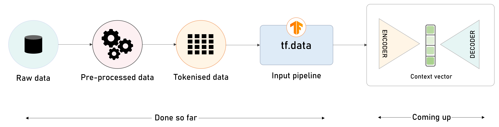
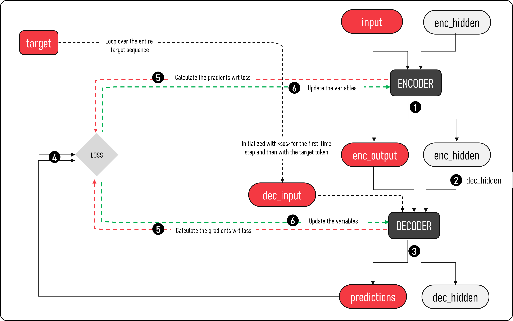
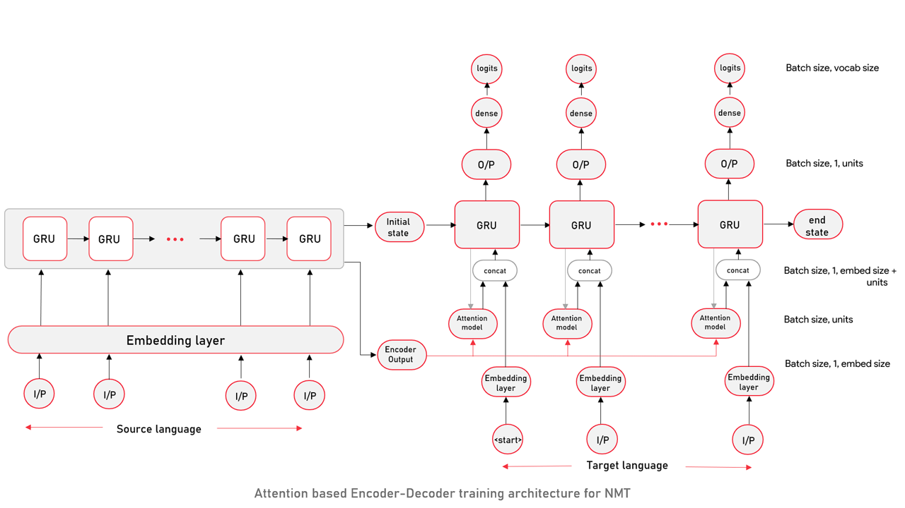
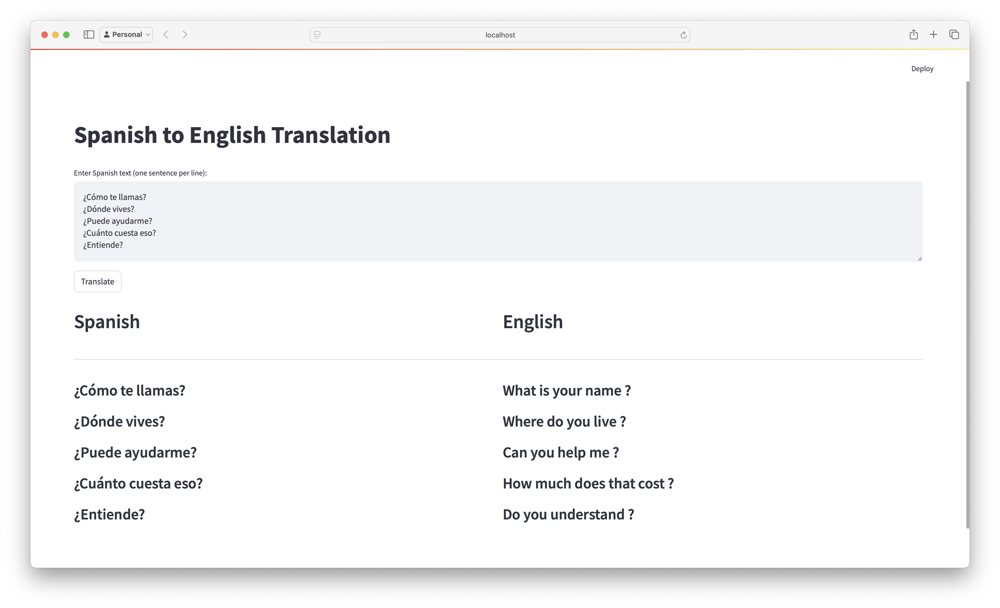
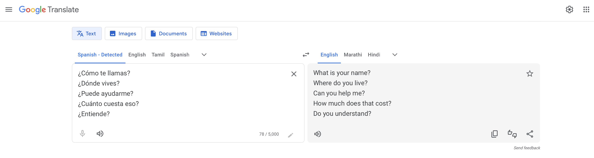

# Spanish-English Translation Model using TensorFlow

## Summary
Presenting a robust and accurate Spanish-English translation model built using TensorFlow, a popular open-source machine learning framework. This repository contains the code for training, testing, and deploying our NMT model, along with visualizations of attention weights to understand how the model translates.

The approach leverages cutting-edge techniques in neural machine translation, including:
- Pre-trained language models 
- Attention-based mechanism for focusing on relevant words 
- Fine-tuning for optimal performance

## Key Features:
- Robust and accurate Spanish-English translations (based on the Training data) 
- Visualizations of attention weights for insight into translation process 
- Easy to use TensorFlow API for training and deployment 
- Compatible with popular libraries like NumPy and Pandas

## Overview:
- **Steps**


- **Model Training**


- **Attention based Encoder-Decoder training architecture for NMT**


## Comparison with Google Translator
- This model


- Google Translate


## Detailed Explanation

### 1. Importing Libraries
   ```python
   import os, io
   import re
   import numpy as np
   import pandas as pd
   import matplotlib.pyplot as plt
   import matplotlib.ticker as ticker
   import tensorflow as tf
   ```
   - This section imports the necessary Python libraries:
     - `os` and `io` for file handling.
     - `re` for regular expressions (though not used in the current code).
     - `numpy` for array manipulation.
     - `pandas` for data analysis (though unused here).
     - `matplotlib` for plotting graphs (though not currently used).
     - `tensorflow` for building deep learning models.

### 2. Downloading and Extracting the Dataset
   ```python
   zip_file = tf.keras.utils.get_file(
       'spa-eng.zip', origin='http://storage.googleapis.com/download.tensorflow.org/data/spa-eng.zip',
       extract=True)
   ```
   - This line uses TensorFlow's utility function to download a zipped file (`spa-eng.zip`) from the given URL. The file contains a dataset of Spanish to English sentence pairs. The `extract=True` flag automatically unzips the file after downloading.

   ```python
   file_path = os.path.dirname(zip_file)+"/spa-eng/spa.txt"
   ```
   - This constructs the file path to the extracted text file containing Spanish-English translations.

### 3. Loading the Data
   ```python
   def load_data(path, size=None):
       text = io.open(path, encoding='UTF-8').read()
       lines = text.split('\n')[:-1]
       pairs = [line.split('\t') for line in lines]
       source = np.array([source for target, source in pairs])
       target = np.array([target for target, source in pairs])
       return source, target
   ```
   - This function reads and processes the data.
     - `io.open(path, encoding='UTF-8')` opens and reads the file with UTF-8 encoding.
     - `lines = text.split('\n')[:-1]` splits the text into individual lines (each representing a sentence pair), except for the last line, which is ignored (likely because it's empty).
     - `pairs = [line.split('\t') for line in lines]` splits each line into a source-target pair of sentences (Spanish and English) using the tab (`\t`) separator.
     - The source (Spanish) and target (English) sentences are then stored in NumPy arrays.

### 4. Printing a Sample Translation
   ```python
   src_sentences, tgt_sentences = load_data(file_path)
   print("Original Sentence:", src_sentences[42])
   print("Translated Sentence:", tgt_sentences[42])
   ```
   - This loads the data using the `load_data()` function and prints the 43rd sentence in both Spanish (`src_sentences[42]`) and English (`tgt_sentences[42]`).

This code will create two visualizations for the length of sentences (in terms of word count) for both English and Spanish sentences. Here's a breakdown of each part:

### 5. Creating a DataFrame of Source and Target Sentences
   ```python
   df = pd.DataFrame(zip(src_sentences, tgt_sentences), columns=['source_sentence', 'target_sentence'])
   df
   ```
   - A `pandas` DataFrame is created with two columns: `'source_sentence'` and `'target_sentence'`. This DataFrame stores the Spanish sentences (`src_sentences`) and their corresponding English translations (`tgt_sentences`).

### 6. Calculating the Sentence Lengths
   ```python
   eng_len = []
   span_len = []

   for i in src_sentences:
       eng_len.append(len(i.split()))  

   for i in tgt_sentences:
       span_len.append(len(i.split()))
   ```
   - `eng_len`: A list to store the number of words in each **Spanish** sentence.
   - `span_len`: A list to store the number of words in each **English** sentence.
   - `len(i.split())`: Splits each sentence into words and counts how many words are in each sentence.

### 7. Creating the Length DataFrame
   ```python
   length_df = pd.DataFrame({'english':eng_len, 'spanish':span_len})
   ```
   - This creates a new DataFrame `length_df` that contains the word counts for each English and Spanish sentence.

### 8. Plotting the Histogram
   ```python
   length_df.hist(bins = 20)
   plt.show()
   ```
   - The `.hist()` method generates a histogram for both columns (`english` and `spanish`) showing the distribution of sentence lengths. The `bins=20` argument specifies that the x-axis will be divided into 20 bins (ranges of word counts).
   - `plt.show()` displays the histograms.

Here's an explanation of the provided code and how to fill in the missing parts:

### 9. Importing Necessary Libraries
```python
import re, itertools
from collections import Counter
import tensorflow as tf
from tensorflow.keras.preprocessing.text import Tokenizer
from tensorflow.keras.preprocessing.sequence import pad_sequences
from sklearn.model_selection import train_test_split
import unicodedata
```
- **`re`**: Regular expressions for pattern matching in text processing.
- **`itertools`** and **`Counter`**: Useful for counting and manipulating iterables (though not used in this particular code yet).
- **`tensorflow.keras.preprocessing`**: Text preprocessing utilities for tokenization and sequence padding.
- **`unicodedata`**: Used for Unicode text normalization.
- **`train_test_split`**: For splitting data into training and test sets.

### 10. Function: `unicode_to_ascii`
This function, `unicode_to_ascii`, is used to convert a given string into ASCII characters while excluding non-ASCII characters with certain categories.

```python
import unicodedata
```

*   This line imports the `unicodedata` module, which provides functions for working with Unicode characters.
    *   The `unicodedata` module is used to normalize and categorize Unicode characters.

```python
def unicode_to_ascii(s):
```

*   This line defines a function named `unicode_to_ascii` that takes one parameter:
    *   `s`: A string to be converted into ASCII characters.

```python
# Normalize the input string `s` to its decomposed form
normalized = unicodedata.normalize('NFD', s)
```

*   This line normalizes the input string `s` by converting it to its decomposed form using the `'NFD'` normalization type.
    *   The `'NFD'` normalization type splits each character into its base character and a separate combining character.
    *   For example, the space character ' ' would be normalized to its base character ' ' and the combined space mark character '\u200b'.

```python
# Return a new string that only contains ASCII characters
# Exclude characters with the category "Mark, Nonspacing"
return ''.join(c for c in normalized if unicodedata.category(c) != 'Mn')
```

*   This line returns a new string containing only the ASCII characters from the normalized input string.
    *   The `unicodedata.category(c)` function is used to determine the Unicode category of each character in the normalized string.
    *   Characters with the category `"Mark, Nonspacing"` (such as diacritical marks and combining characters) are excluded from the output string.
    *   The `join()` function is used to concatenate the ASCII characters into a single string.

### 11. Function: `preprocess_text`
This function, `preprocess_text`, is used to preprocess input text data by removing special characters, lowercasing it and adding start and end tokens.

```python
def preprocess_text(text):
```

*   This line defines a function named `preprocess_text` that takes one parameter:
    *   `text`: The input text string to be preprocessed.

```python
"""
Preprocess the input text data by removing special characters, lowercasing it and adding start and end tokens

Arguments:
    text (str): Input text string

Returns:
    preprocessed_text (str): Preprocessed text string with added start and end tokens
"""
```

*   This is a docstring that provides documentation for the `preprocess_text` function.
    *   It explains what the function does, its input parameters, and its return value.

```python
text = unicode_to_ascii(text).lower()
```

*   This line preprocesses the input text by converting it into ASCII characters while excluding non-ASCII characters.
    *   The `unicode_to_ascii` function is called with the input text as its argument.
    *   The result is converted to lowercase using the `lower()` method.

```python
text = re.sub(r'[^a-zA-Z.?!,]', ' ', text)
```

*   This line replaces special characters in the preprocessed text with spaces.
    *   The `re.sub` function is used to replace substrings in a string.
    *   The regular expression `r'[^a-zA-Z.?!,]'` matches any character that is not a letter (both uppercase and lowercase), a period, an exclamation mark, or a comma.
    *   The replacement string `' '` replaces these characters with spaces.

```python
text = re.sub(r'([?.!,¿])', r' \1 ', text)
```

*   This line inserts a space before and after certain punctuation marks in the preprocessed text.
    *   The `re.sub` function is used again to replace substrings in the string.
    *   The regular expression `r'([?.!,¿])'` matches any of the characters `.`, `!`, `,`, or `¿`.
    *   The replacement string `r' \1 '` inserts a space before and after each matched character.

```python
text = re.sub(r'\s+', ' ', text)
```

*   This line replaces multiple consecutive spaces in the preprocessed text with a single space.
    *   The `re.sub` function is used again to replace substrings in the string.
    *   The regular expression `r'\s+'` matches one or more whitespace characters (spaces, tabs, newlines).
    *   The replacement string `' '` replaces these consecutive spaces with a single space.

```python
text = text.strip()
```

*   This line removes leading and trailing whitespace from the preprocessed text.
    *   The `strip` method is called on the text string to remove any leading or trailing whitespace characters.

```python
text = '<sos> ' + text + ' <eos>'
```

*   This line adds start and end tokens (`<sos>` and `<eos>`) to the preprocessed text.
    *   The `+` operator is used to concatenate the strings.

```python
return text
```

*   This line returns the final preprocessed text with added start and end tokens.

### 12. Function: `tokenize`

This function, `tokenize`, is used to tokenize input sentences by applying a tokenizer object. The tokenized sequences are returned along with the tokenizer object and the maximum length of the sequences.

```python
def tokenize(sentences):
```

*   This line defines a function named `tokenize` that takes one parameter:
    *   `sentences`: A list of sentences to be tokenized.

```python
"""
Tokenizes the input sentences and returns the tokenized sequences, tokenizer object, and the max length of the sequences.

Parameters:
sentences (list): A list of sentences to be tokenized.

Returns:
sequences (numpy array): The tokenized sequences.
lang_tokenizer (Tokenizer object): Tokenizer object fit on the input sentences.
max_length (int): Maximum length of the sequences.
"""
```

*   This is a docstring that provides a description of what the `tokenize` function does, including its parameter and return values.

```python
# Initialize the tokenizer object
lang_tokenizer = Tokenizer(filters='')
```

*   This line initializes a new `Tokenizer` object with an empty list of filters.
    *   The `Tokenizer` class is likely a custom class that provides methods for tokenizing text data.
    *   In this case, no specific filters are applied to the tokenizer.

```python
# Fit the tokenizer on the input sentences
lang_tokenizer.fit_on_texts(sentences)
```

*   This line fits the initialized tokenizer object on the input sentences by calling the `fit_on_texts` method.
    *   The `fit_on_texts` method is likely responsible for learning the vocabulary and other parameters of the tokenizer based on the input data.

```python
# Tokenize the sentences
sequences = lang_tokenizer.texts_to_sequences(sentences)
```

*   This line tokenizes the input sentences by calling the `texts_to_sequences` method.
    *   The `texts_to_sequences` method converts each sentence into a list of integers, where each integer represents a unique word or token in the vocabulary.

```python
# Find the max length of the sequences
max_length = max(len(s) for s in sequences)
```

*   This line finds the maximum length among all the sequences by using the `max` function with a generator expression.
    *   The generator expression iterates over each sequence and returns its length.

```python
# Pad and truncate the sequences
sequences = pad_sequences(sequences, maxlen=max_length, padding='post', truncating='post')
```

*   This line pads or truncates the sequences to ensure they have a uniform maximum length.
    *   The `pad_sequences` function applies padding to the shorter sequences by adding special tokens (e.g., `[PAD]`) at the end of each sequence until all sequences have the same length as the longest sequence.

```python
return sequences, lang_tokenizer, max_length
```

*   Finally, this line returns three values:
    1. `sequences`: The tokenized sequences.
    2. `lang_tokenizer`: The tokenizer object that was fit on the input sentences.
    3. `max_length`: The maximum length of the sequences after padding or truncation.

### 13. Function `load_sequences`

This function, `load_sequences`, is used to load and preprocess a dataset for language modeling tasks. It loads the data from a specified path, preprocesses the source and target sentences, tokenizes them using a tokenizer object, and returns the preprocessed sequences along with their corresponding tokenizer objects and maximum sequence lengths.

```python
def load_sequences(path, size=None):
```

*   This line defines a function named `load_sequences` that takes two parameters:
    *   `path`: The path to the dataset file.
    *   `size`: An optional parameter representing the number of data points to load. If not provided, it loads all available data.

```python
"""
Loads and preprocesses the dataset.

Parameters:
- path (str): The path to the dataset file.
- size (int, optional): The number of data points to load. Default is None which loads all the data.

Returns:
- src_sequences (np.array): Array of preprocessed and tokenized source sentences.
- tgt_sequences (np.array): Array of preprocessed and tokenized target sentences.
- src_lang_tokenizer (Tokenizer): Tokenizer object fit on source sentences.
- tgt_lang_tokenizer (Tokenizer): Tokenizer object fit on target sentences.
- max_length_src (int): Maximum length of source sequences.
- max_length_trg (int): Maximum length of target sequences.
"""
```

*   This is a docstring that provides a description of what the `load_sequences` function does, including its parameters and return values.

```python
# Load the data again using the load_data function with the size argument
if size is None:
    data = load_data(path)
else:
    data = load_data(path, size)
```

*   This code snippet uses the `load_data` function to load the dataset from the specified path. If `size` is not provided (`None`), it loads all available data; otherwise, it loads only that number of samples.

```python
# Preprocess the source and target sentences
source = [preprocess_text(x) for x in data['source']]
target = [preprocess_text(x) for x in data['target']]
```

*   These lines preprocess the source and target sentences by applying a text preprocessing function (`preprocess_text`) to each sentence.

```python
# Tokenize the source and target sentences
src_sequences, src_lang_tokenizer, max_length_src = tokenize(source)
tgt_sequences, tgt_lang_tokenizer, max_length_trg = tokenize(target)
```

*   These lines tokenize the preprocessed source and target sentences using a tokenizer object (`tokenize` function). The resulting sequences are stored in `src_sequences` and `tgt_sequences`, while their corresponding tokenizer objects are stored in `src_lang_tokenizer` and `tgt_lang_tokenizer`. Additionally, the maximum sequence lengths for source and target sequences are stored in `max_length_src` and `max_length_trg`.

```python
return src_sequences, tgt_sequences, src_lang_tokenizer, tgt_lang_tokenizer, max_length_src, max_length_trg
```

*   Finally, this line returns all the preprocessed sequences along with their corresponding tokenizer objects and maximum sequence lengths.

### 14. Sequence Data Preprocessing and Tokenization

This code snippet is used to print the shape of source sequences (`src_sequences`) and target sequences (`tgt_sequences`) after loading them from a file.

```python
# Load sequences from a file with specified size (in this case, 40000)
src_sequences, tgt_sequences, src_tokenizer, tgt_tokenizer, max_length_src, max_length_trg = load_sequences(file_path, size=40000)

# Print the shape of source and target sequences along with a separator for better readability.
print(f'Sequences \t | \t Shape')
print('=' * 30)
print('Source \t\t | \t', src_sequences.shape) # This line prints the shape of source sequences
print('-' * 30) 
print('Target \t\t | \t', tgt_sequences.shape) # This line prints the shape of target sequences

# Print the actual data for better understanding (optional)
print("Original sentence:", src_sentences[42])
print("Text after preprocessing:", clean_src_sentences[42]) # These lines print a specific source sequence 
print("Text after tokenization:", src_sequences[42])  # This line prints a specific source sequence that has been tokenized

# Define a function to convert tensor indices to word representations
def convert(lang, tensor):
    for t in tensor:
        if t!=0: # Iterate over each element in the tensor
            print ("%d ----> %s" % (t, lang.index_word[t])) # Convert index 't' to its corresponding word representation

# Test the word-to-index mapping of source language.
print ("Input Language; index to word mapping") 
convert(src_tokenizer, src_sequences[42]) # Use a specific tensor element from the source sequences
print () # Print an empty line for better readability
print ("Target Language; index to word mapping")
convert(tgt_tokenizer, tgt_sequences[42]) # Use a specific tensor element from the target sequences
```

This code first loads sequence data into `src_sequences` and `tgt_sequences`. Then it prints their shape using Python's built-in tuple data structure, which represents multi-dimensional arrays. The shapes are printed with labels to indicate whether they represent source or target sequences.

Next, it prints specific sentences from the source sequence to illustrate what the sequence data looks like before preprocessing and tokenization.

After that, it defines a function called `convert` which takes a language object (`lang`) and a tensor as input. The `convert` function then iterates over each element in the tensor, checking if it's not zero (i.e., if the element has an index). If the element is non-zero, it prints its corresponding word representation from the language object.

Finally, it uses the `convert` function to test whether the word-to-index mapping for both source and target languages are correct. It does this by passing in specific tensor elements from each sequence along with their respective tokenizers.

### 15. Retrieving Vocabulary Sizes from Tokenizers

This code snippet retrieves the size of the input vocabulary (`src_vocab_size`) and output vocabulary (`tgt_vocab_size`) from their respective tokenizers.

```python
# Get the number of words in the source vocabulary by getting its length
src_vocab_size = len(src_tokenizer.word_index)

# Get the number of words in the target vocabulary by getting its length
tgt_vocab_size = len(tgt_tokenizer.word_index)

# Print the sizes of both vocabularies
print(src_vocab_size)
print(tgt_vocab_size)
```

1. `src_vocab_size = len(src_tokenizer.word_index)`:
   - This line retrieves the size of the source vocabulary by accessing its word-to-index mapping stored in `src_tokenizer`.
   - The `word_index` attribute is a dictionary that maps each unique word to its corresponding integer index.
   - By taking the length of this dictionary (`len()` function), we can determine the total number of words present in the source vocabulary.

2. `tgt_vocab_size = len(tgt_tokenizer.word_index)`:
   - This line retrieves the size of the target vocabulary by accessing its word-to-index mapping stored in `tgt_tokenizer`.
   - The logic is identical to the first line, with the exception that it accesses the dictionary for the target language (`tgt_tokenizer`).

3. `print(src_vocab_size)` and `print(tgt_vocab_size)`:
   - These lines print the sizes of both the source and target vocabularies to the console.
   - The output will be the total number of unique words present in each vocabulary.

### 16. Creating Datasets with Hyperparameter Tuning for Efficient Training

This code snippet defines hyperparameters, creates dataset objects for training and validation sets, shuffles and batches these datasets to prepare them for model training.

```python
# Defining hyperparameters based on the buffer sizes of the source sequences.
buffer_size=len(source_sequences_train)
val_buffer_size = len(source_sequences_val)

# Setting batch size to 64 as a common choice in deep learning.
BATCH_SIZE = 64

# Defining embedding dimension and number of units for the model layers.
embedding_dim = 128
units = 1024 

# Calculating steps per epoch by dividing buffer size by batch size, assuming uniform sampling from the buffer.
steps_per_epoch = buffer_size//BATCH_SIZE

# Similarly, calculating validation steps per epoch using the same logic but with validation buffer size.
val_steps_per_epoch = val_buffer_size//BATCH_SIZE

# Creating a dataset object for training using 'from_tensor_slices' method, which creates an iterator over the source and target sequences.
train_dataset = tf.data.Dataset.from_tensor_slices((source_sequences_train, tgt_sequences_train))

# Shuffling the training dataset using 'shuffle' method to randomize order of data during training.
train_dataset = train_dataset.shuffle(buffer_size=buffer_size)

# Batching the shuffled training dataset into batches of size 'BATCH_SIZE'.
train_dataset = train_dataset.batch(BATCH_SIZE)

# Creating a dataset object for validation using the same 'from_tensor_slices' method as before, but for the validation set this time.
val_dataset = tf.data.Dataset.from_tensor_slices((source_sequences_val, tgt_sequences_val))

# Batching the validation dataset into batches of size 'BATCH_SIZE', just like the training dataset.
val_dataset = val_dataset.batch(BATCH_SIZE)
```

1. `buffer_size=len(source_sequences_train)` and `val_buffer_size = len(source_sequences_val)`:
   - These lines retrieve the lengths of the source sequences in both the training and validation sets.

2. `BATCH_SIZE = 64`:
   - This line sets the batch size for both datasets to 64, which is a common choice in deep learning for balancing computational efficiency with model capacity.

3. `embedding_dim = 128` and `units = 1024`:
   - These lines define the embedding dimension and number of units for the model layers, respectively.

4. `steps_per_epoch = buffer_size//BATCH_SIZE` and `val_steps_per_epoch = val_buffer_size//BATCH_SIZE`:
   - These lines calculate the steps per epoch by dividing the buffer size (source sequence length) by the batch size. This assumes uniform sampling from the buffer during training, where all sequences in the buffer have an equal chance of being selected for a given batch.

5. `train_dataset = tf.data.Dataset.from_tensor_slices((source_sequences_train, tgt_sequences_train))`:
   - This line creates a dataset object for the training set using the 'from_tensor_slices' method, which creates an iterator over the source and target sequences from the training buffer.

6. `train_dataset = train_dataset.shuffle(buffer_size=buffer_size)`:
   - This line shuffles the training dataset to randomize the order of data during training.

7. `train_dataset = train_dataset.batch(BATCH_SIZE)`:
   - This line batches the shuffled training dataset into batches of size 'BATCH_SIZE', which will be used for model training.

8. `val_dataset = tf.data.Dataset.from_tensor_slices((source_sequences_val, tgt_sequences_val))` and `val_dataset = val_dataset.batch(BATCH_SIZE)`:
   - These lines create a dataset object for the validation set using the same 'from_tensor_slices' method as before, but for the validation set this time. It then batches the validation dataset into batches of size 'BATCH_SIZE', just like the training dataset.

### 17. Visualizing the Shape of Input Batch and Target Batch

This code snippet retrieves a single example from the training dataset using `next(iter(train_dataset))`, unpacks it into an input batch (`example_input_batch`) and a target batch (`example_target_batch`), and prints their shapes.

```python
# Retrieve a single example from the training dataset.
example_input_batch, example_target_batch = next(iter(train_dataset))

# Print the shape of the input batch and the target batch.
print(example_input_batch.shape)
print(example_target_batch.shape)
```

1. `next(iter(train_dataset))`:
   - This line retrieves a single example from the training dataset by iterating over it using the `iter()` function, which returns an iterator object. The `next()` function is then used to retrieve the next item (i.e., the first example) from this iterator.

2. `example_input_batch, example_target_batch = ...`:
   - This line unpacks the retrieved example into two variables: `example_input_batch` and `example_target_batch`. These variables will hold the input data and target labels for a single example in the dataset.

3. `print(example_input_batch.shape)` and `print(example_target_batch.shape)`:
   - These lines print the shape of the input batch (`example_input_batch`) and the target batch (`example_target_batch`) using the `.shape` attribute, which returns a tuple representing the dimensions of the array (e.g., `(batch_size, sequence_length)`).

### 18. Defining the Encoder Model for Sequence-to-Sequence Training

This code snippet defines an Encoder model using Keras, which is a crucial component of the Seq2Seq model. The model consists of two main components: an embedding layer and a GRU (Gated Recurrent Unit) layer.

```python
# Define the Encoder model
class Encoder(tf.keras.Model):
    """
    The Encoder model for the Seq2Seq model

    """

    # Constructor method that initializes the model's components
    def __init__(self, vocab_size, emb_dim, enc_units, batch_sz):
        super(Encoder, self).__init__()
        # Store the number of GRU units in the encoder
        self.enc_units = enc_units 
        # Store the batch size
        self.batch_sz = batch_sz 
        # Define the embedding layer for the input sequence
        self.embedding = tf.keras.layers.Embedding(vocab_size, emb_dim,mask_zero=True)
        # Define the GRU layer for encoding the input sequence
        self.gru = tf.keras.layers.GRU(self.enc_units,
                                       return_sequences=True,
                                       return_state=True,
                                       recurrent_initializer='glorot_uniform') 

    # Forward pass method that defines how the model processes the input data
    def call(self, x, hidden):
        """
        Forward pass for the Encoder model

        """

        # Pass the input sequence through the embedding layer
        # The embedding layer converts the input tokens into a dense vector representation.
        # In this case, we're using an embedding layer with `vocab_size` as the input size and `emb_dim` as the output size.
        x = self.embedding(x)

        # Embed the input sequence, resulting in shape (batch_size, sequence_length, emb_dim)
        # The `mask_zero=True` argument ensures that padded tokens are represented by zeros.

        # Pass the embedded input sequence and initial hidden state through the GRU layer to return the output & hidden state.
        # The `return_sequences=True` argument indicates that we want the model to return the output at each time step.
        # The `return_state=True` argument indicates that we want to return the hidden state of the GRU layer as well.
        # The `recurrent_initializer='glorot_uniform'` argument initializes the recurrent weights using a uniform distribution with a specified scale (in this case, `glorot_uniform`).
        output, state = self.gru(x, initial_state=hidden)
        
        # The output shape is (batch_size, sequence_length, enc_units)
        # The state shape is (batch_size, enc_units)
        return output, state 

    # Method to initialize the hidden state of the GRU layer to all zeros
    def initialize_hidden_state(self):
        """
        Initialize the hidden state of the GRU to all zeros

        """

        # Initialize the hidden state of the GRU layer to all zeros.
        # This method returns a tensor with shape `(batch_size, enc_units)` initialized to zero.
        return tf.zeros((self.batch_sz, self.enc_units))
```

* `super(Encoder, self).__init__()`: Initializes the Encoder model by calling the constructor method of its parent class (`tf.keras.Model`).
* `self.enc_units = enc_units`: Stores the number of GRU units in the encoder for future reference.
* `self.batch_sz = batch_sz`: Stores the batch size for future reference.
* `self.embedding = tf.keras.layers.Embedding(vocab_size, emb_dim, mask_zero=True)`: Defines an embedding layer with the specified vocabulary size and embedding dimension. The `mask_zero=True` argument ensures that padded tokens are represented by zeros.
* `self.gru = tf.keras.layers.GRU(self.enc_units, return_sequences=True, return_state=True, recurrent_initializer='glorot_uniform')`: Defines a GRU layer with the specified number of units, output size, and initialization method. The `return_sequences=True` argument indicates that we want the model to return the output at each time step, while `return_state=True` indicates that we want to return the hidden state as well.
* `x = self.embedding(x)`: Passes the input sequence through the embedding layer.
* `output, state = self.gru(x, initial_state=hidden)`: Passes the embedded input sequence and initial hidden state through the GRU layer to return the output and hidden state.
* `return tf.zeros((self.batch_sz, self.enc_units))`: Initializes the hidden state of the GRU layer to all zeros.

### 19. Creating an Encoder Class Object and Sample Input Processing

This section demonstrates how to create an instance of the Encoder class, initialize its hidden state, process sample input data through the encoder, and print out the shapes of the output and hidden states.

```python
#Create an Encoder class object
encoder = Encoder(src_vocab_size, embedding_dim, units, BATCH_SIZE) 
```

* This line creates a new instance of the Encoder class by passing in the required arguments:
	+ `src_vocab_size`: The vocabulary size of the source language.
	+ `embedding_dim`: The dimensionality of the embedded representations.
	+ `units`: The number of units in the GRU layer.
	+ `BATCH_SIZE`: The batch size for processing input data.

```python
# sample input to get a sense of the shapes.
sample_hidden = encoder.initialize_hidden_state()
```

* This line calls the `initialize_hidden_state` method on the encoder instance, which returns an initial hidden state for the GRU layer. The returned value is assigned to the variable `sample_hidden`.

```python
sample_output, sample_hidden = encoder(example_input_batch, sample_hidden)
```

* This line calls the `call` method on the encoder instance, passing in two arguments:
	+ `example_input_batch`: A sample input batch of sequence data.
	+ `sample_hidden`: The initialized hidden state from the previous step.

The `call` method processes the input data through the embedding layer and GRU layer, producing output and updating the hidden state. The updated hidden state is assigned to the variable `sample_hidden`.

```python
print ('Encoder output shape: (batch size, sequence length, units) {}'.format(sample_output.shape))
print ('Encoder Hidden state shape: (batch size, units) {}'.format(sample_hidden.shape))
```

* These two lines print out the shapes of the `sample_output` and `sample_hidden` variables using the `.shape` attribute.
	+ The output shape is expected to be `(BATCH_SIZE, sequence_length, units)`, where:
		- `BATCH_SIZE` is the batch size passed into the encoder.
		- `sequence_length` is the length of the input sequence data (not specified in this example).
		- `units` is the number of units in the GRU layer.
	+ The hidden state shape is expected to be `(BATCH_SIZE, units)`, where:
		- `BATCH_SIZE` is the batch size passed into the encoder.
		- `units` is the number of units in the GRU layer.

### 20. Implementing Bahdanau Attention Layer in TensorFlow

This section demonstrates how to implement a Bahdanau attention layer using TensorFlow Keras. The implementation includes the definition of the attention layer class, its forward pass method, and example usage.

```python
# Define the BahdanauAttention class
class BahdanauAttention(tf.keras.layers.Layer):
  """
    Attention model for the Seq2Seq model

  """
  def __init__(self, units):
    super(BahdanauAttention, self).__init__()
    # Define fully-connected dense layers
    self.W1 = tf.keras.layers.Dense(units)
    self.W2 = tf.keras.layers.Dense(units)
    self.V = tf.keras.layers.Dense(1)

  def call(self, query, values):
    """
        Forward pass for the Attention model

    """
    # Query hidden state shape == (batch_size, hidden size)
    # Query with time axis shape == (batch_size, 1, hidden size)
    # Values shape == (batch_size, max_len, hidden size)

    # Expand query dimension by 1
    query_with_time_axis = tf.expand_dims(query, 1)

    # Score shape == (batch_size, max_length, 1)
    score = self.V(tf.nn.tanh(self.W1(query_with_time_axis) + self.W2(values)))

    # Attention weights shape == (batch_size, max_length, 1)
    attention_weights = tf.nn.softmax(score, axis=1)

    # Context vector shape == (batch_size, units)
    context_vector = attention_weights * values
    context_vector = tf.reduce_sum(context_vector, axis=1)

    return context_vector, attention_weights

# Create an instance of the BahdanauAttention class
attention_layer = BahdanauAttention(20) 
```

* The `BahdanauAttention` class is defined with two fully-connected dense layers (`W1`, `W2`) and one final dense layer (`V`). This architecture matches the standard implementation of a Bahdanau attention mechanism.

```python
# Pass sample encoder output and hidden layer to get a sense of the shape of the output of the attention layer
attention_result, attention_weights = attention_layer(sample_hidden, sample_output)
```

* The `sample_hidden` and `sample_output` are passed through the `BahdanauAttention` instance. This allows for exploring how the attention layer processes input data.

```python
# Print the shape of the attention result (context vector) and weights
print("Attention result shape (context vector): (batch size, units) {}".format(attention_result.shape))
print("Attention weights shape: (batch_size, sequence_length, 1) {}".format(attention_weights.shape))
```

* The output shapes are printed for both the context vector (`attention_result`) and attention weights (`attention_weights`). These outputs are expected to match the dimensions and structure of the attention mechanism.

### 21. Implementing the Decoder Model in TensorFlow Keras

This section demonstrates how to implement the decoder model using TensorFlow Keras. The implementation includes the definition of the `Decoder` class, its initialization with various layers and parameters.

```python
# Define the Decoder class
class Decoder(tf.keras.Model):
  def __init__(self, vocab_size, emb_dim, dec_units, batch_sz):
    super(Decoder, self).__init__()
    
    # Initialize the batch size
    self.batch_sz = batch_sz 
    
    # Initialize the number of decoder units
    self.dec_units = dec_units 
    
    # Initialize the Bahdanau attention layer
    self.attention = BahdanauAttention(self.dec_units)
    
    # Initialize the embedding layer
    self.embedding = tf.keras.layers.Embedding(vocab_size, emb_dim) 
    
    # Initialize the GRU layer with the number of decoder units, return sequences and state set to True,
    # and the recurrent initializer set to 'glorot_uniform'
    self.gru = tf.keras.layers.GRU(self.dec_units,
                                   return_sequences=True,
                                   return_state=True,
                                   recurrent_initializer='glorot_uniform') 
    # Initialize a fully connected layer with the number of output units equal to the vocabulary size
    self.fc = tf.keras.layers.Dense(vocab_size)
```

* The `Decoder` class is defined as a subclass of `tf.keras.Model`, which is the base class for all Keras models.
* The decoder model takes in several parameters:
	+ `vocab_size`: The number of unique tokens in the vocabulary.
	+ `emb_dim`: The dimensionality of the word embeddings.
	+ `dec_units`: The number of units in the GRU layer.
	+ `batch_sz`: The batch size.

```python
# Initialize the attention layer with the number of decoder units
self.attention = BahdanauAttention(self.dec_units)
```

* The `BahdanauAttention` class is used to initialize an instance of the Bahdanau attention mechanism, which takes in the number of decoder units as a parameter.

```python
# Initialize the embedding layer with the vocabulary size and embedding dimension
self.embedding = tf.keras.layers.Embedding(vocab_size, emb_dim) 
```

* The `tf.keras.layers.Embedding` layer is used to initialize an instance of the word embedding layer, which maps tokens to dense vectors in the embedding space.

```python
# Initialize the GRU layer with the number of decoder units, return sequences and state set to True,
# and the recurrent initializer set to 'glorot_uniform'
self.gru = tf.keras.layers.GRU(self.dec_units,
                               return_sequences=True,
                               return_state=True,
                               recurrent_initializer='glorot_uniform') 
```

* The `tf.keras.layers.GRU` layer is used to initialize an instance of the GRU layer, which takes in the number of decoder units and other parameters.

```python
# Initialize a fully connected layer with the number of output units equal to the vocabulary size
self.fc = tf.keras.layers.Dense(vocab_size)
```

* The `tf.keras.layers.Dense` layer is used to initialize an instance of the fully connected layer, which maps the final hidden state of the GRU to a probability distribution over the vocabulary.

### 22. Decoder Model Implementation

This section provides a detailed explanation of each line of code in the decoder model implementation, highlighting the purpose and functionality of each component.

```python
# Define the Decoder class
class Decoder(tf.keras.Model):
```

* This line defines a new class called `Decoder` that inherits from the `tf.keras.Model` class. The `tf.keras.Model` class is the base class for all Keras models, providing a foundation for building and customizing neural network architectures.

```python
def call(self, x, hidden, enc_output):
```

* This line defines a method called `call`, which is a special method in Keras models that is used to compute the output of the model. The `call` method takes three arguments: `self` (a reference to the current instance of the class), `x`, and two other variables (`hidden` and `enc_output`) that are passed as keyword arguments.

```python
# Get the context vector and attention weights from the attention layer
context_vector, attention_weights = self.attention(hidden, enc_output)
```

* This line calls the `attention` method on the current instance of the class (i.e., `self`). The `attention` method is responsible for computing the attention weights and output of the attention mechanism. It takes two arguments: `hidden` and `enc_output`. The return value of this method call is a tuple containing the `context_vector` and `attention_weights`.

```python
# Pass the input sequence through the embedding layer
x = self.embedding(x)
```

* This line calls the `embedding` method on the current instance of the class (i.e., `self`). The `embedding` method is responsible for mapping the input sequence to a dense vector representation using an embedding layer. It takes one argument: `x`, which is passed as keyword argument.

```python
# Concatenate the context vector and the embedded input sequence
x = tf.concat([tf.expand_dims(context_vector, 1), x], axis=-1)
```

* This line concatenates the `context_vector` with the output of the embedding layer (`x`) using a concatenation operation. The resulting tensor is then reshaped to have an additional dimension (the original dimensionality of `x`). This step is performed using the `tf.concat` function, which takes two arguments: a list of tensors to be concatenated and the axis along which they should be concatenated.

```python
# Pass the concatenated sequence and the initial state to the GRU as the hidden state
output, state = self.gru(x)
```

* This line calls the `gru` method on the current instance of the class (i.e., `self`). The `gru` method is responsible for computing the output of a gated recurrent unit (GRU) layer. It takes one argument: `x`, which is passed as keyword argument.

```python
# Reshape the GRU output to be of shape (batch_size * 1, hidden_size)
output = tf.reshape(output, (-1, output.shape[2]))
```

* This line reshapes the output of the GRU layer (`output`) to have a new shape. The `tf.reshape` function takes two arguments: an existing tensor to be reshaped and the desired shape of the resulting tensor.

```python
# Pass the reshaped output through the fully connected layer to get the final output
x = self.fc(output)
```

* This line calls the `fc` method on the current instance of the class (i.e., `self`). The `fc` method is responsible for computing the output of a fully connected layer. It takes one argument: `output`, which is passed as keyword argument.

```python
# Return the decoder output, decoder state and attention weights
return x, state , attention_weights
```

* This line returns the final output (`x`) and the internal state of the model (`state`) along with the attention weights. The return statement takes two arguments: `x` (the final output) and a tuple containing the `state` and `attention_weights`.

### 23. Understanding the Decoder Model Implementation

This section provides a detailed explanation of each line of code in the provided snippet, highlighting the purpose and functionality of each component.

```python
# Create an Decoder class object
decoder = Decoder(tgt_vocab_size, embedding_dim, units, BATCH_SIZE)
```

* This line creates an instance of the `Decoder` class.
* The `Decoder` class is a custom class designed to decode input sequences using a sequence-to-sequence model.
* The constructor of the `Decoder` class takes four arguments:
	+ `tgt_vocab_size`: the size of the target vocabulary, which represents the number of possible output tokens.
	+ `embedding_dim`: the dimensionality of the embedding layer used for input sequences.
	+ `units`: the number of units in the GRU (Gated Recurrent Unit) layer used for decoding.
	+ `BATCH_SIZE`: the batch size of the decoder model, which determines how many input sequences are processed simultaneously.

```python
# Sample input to get a sense of the shapes.
sample_decoder_output, _, _ = decoder(tf.random.uniform((BATCH_SIZE, 1)),
                                        sample_hidden, sample_output)
```

* This line calls the `call` method on the `decoder` instance, which is responsible for decoding an input sequence.
* The `call` method takes three arguments:
	+ `tf.random.uniform((BATCH_SIZE, 1))`: a random tensor with shape `(BATCH_SIZE, 1)`, which represents the input sequence to be decoded. This tensor contains one token from each batch in the decoder's input queue.
	+ `sample_hidden`: a hidden state variable used by the GRU layer during decoding. The specific value of this variable is not relevant for this snippet.
	+ `sample_output`: an output variable that represents the output of the decoder at a given time step. The specific value of this variable is not relevant for this snippet.
* When the `call` method is called, it returns three values:
	+ `sample_decoder_output`: the decoded output sequence at the current time step.
	+ `hidden_state`: the updated hidden state of the GRU layer after processing the input sequence.
	+ `output`: the output of the decoder at the current time step (not used in this snippet).
* The `_` variable is used to ignore the value of `hidden_state` and `output`, since they are not relevant for this specific snippet.

```python
print ('Decoder output shape: (batch_size, vocab size) {}'.format(sample_decoder_output.shape))
```

* This line prints a message indicating the shape of the decoder's output.
* The `.shape` attribute is used to access the dimensionality of the tensor `sample_decoder_output`.
* The resulting string includes two values:
	+ `batch_size`: the number of tokens in the input sequence, which represents the batch size of the decoder model.
	+ `vocab_size`: the number of possible output tokens, which corresponds to the `tgt_vocab_size` argument passed to the `Decoder` constructor.

### 24. Understanding the Training Loop Implementation

This section provides a detailed explanation of each line of code in the provided snippet, highlighting the purpose and functionality of each component.

```python
# Define the loss function and the optimizer
```

* This line begins the definition of the training loop components.
* The `loss_object` variable is assigned the value of `tf.keras.losses.SparseCategoricalCrossentropy`, which is a built-in Keras loss function designed for sparse categorical cross-entropy problems.

```python
# Use the Adam optimizer
optimizer = tf.keras.optimizers.legacy.Adam()                   # Using Legacy to avoid performance issue on M2 Macs
```

* This line creates an instance of the `Adam` optimizer, which is a popular stochastic gradient descent (SGD) algorithm variant used for training neural networks.
* The `legacy` suffix is added to the `Adam` class, which is used to avoid performance issues on certain hardware platforms, such as Apple's M2 Macs.

```python
# Loss function is sparse categorical cross entropy
loss_object = tf.keras.losses.SparseCategoricalCrossentropy(from_logits=True, reduction='none')
```

* This line defines the loss function used in the training loop.
* The `SparseCategoricalCrossentropy` class takes two arguments:
	+ `from_logits`: a boolean flag indicating whether the input is already in logits format (i.e., unnormalized scores).
	+ `reduction`: a string representing the reduction mode, which determines how to compute the loss.

```python
# Define the loss function to calculate the difference between the real and predicted outputs
def loss_function(real, pred):
```

* This line defines a custom loss function that calculates the difference between the real and predicted output values.
* The `loss_function` takes two arguments: `real` (the target output) and `pred` (the predicted output).

```python
  mask = tf.math.logical_not(tf.math.equal(real, 0))  # Create a mask to ignore the padding values in the target sequence
```

* This line creates a mask that ignores padding values in the target sequence.
* The mask is created using `tf.math.logical_not`, which returns `True` for all elements except where `real` equals 0.

```python
  loss_ = loss_object(real, pred)  # Calculate the loss using the loss function
```

* This line calculates the loss using the `loss_object`.
* The `loss_object` is called with `real` and `pred` as arguments, which computes the sparse categorical cross-entropy loss.

```python
# Multiply the loss by the mask to ignore the padding values
mask = tf.cast(mask, dtype=loss_.dtype)  # Cast the mask to the same data type as the loss
loss_ *= mask
```

* These lines multiply the original loss value with the mask to effectively ignore padding values.
* The `tf.cast` function is used to cast the mask to the same data type as the loss.

```python
# Calculate the mean loss across the batch size
return tf.reduce_mean(loss_)
```

* This line calculates the mean loss across the batch size.
* The `tf.reduce_mean` function reduces the loss values along the last dimension of the tensor.

```python
# Define the checkpoint path to save the training progress
checkpoint_dir = './training_checkpoints'  # Directory to store the checkpoints
checkpoint_prefix = os.path.join(checkpoint_dir, "ckpt")  # File prefix for the checkpoints
checkpoint = tf.train.Checkpoint(optimizer=optimizer,  # Create a checkpoint object to save the optimizer and the models
                                 encoder=encoder,
                                 decoder=decoder)
```

* These lines define the checkpoint directory and file prefix.
* The `tf.train.Checkpoint` class is used to create a checkpoint object that stores the trained model weights, optimizer state, and other relevant information.
* The checkpoint object takes three arguments:
	+ `optimizer`: an instance of the `Adam` optimizer.
	+ `encoder` and `decoder`: instances of the encoder and decoder models (not shown in this snippet).

### 25. Understanding the Train Step Implementation

This section provides a detailed explanation of each line of code in the provided snippet, highlighting the purpose and functionality of each component.

```python
@tf.function
def train_step(inp, targ, enc_hidden):
```

* This line defines a TensorFlow function (`tf.function`) that encapsulates the training step.
* The `train_step` function takes three arguments: `inp` (input), `targ` (target sequence), and `enc_hidden` (encoder hidden state).

```python
# Initialize loss to 0
loss = 0
```

* This line initializes a variable `loss` to zero, which will be used to accumulate the total loss across all time steps.

```python
# Start recording operations for automatic differentiation
with tf.GradientTape() as tape:
```

* These lines start recording the operations within the `train_step` function using TensorFlow's GradientTape.
* The `GradientTape` object allows us to compute the gradients of the loss with respect to the model variables.

```python
# Encode the input with the hidden state and get the encoded output and the hidden state
enc_output, enc_hidden = encoder(inp, enc_hidden)
```

* These lines encode the input using the `encoder`, along with the given `enc_hidden` state.
* The `encoder` returns a tuple containing the encoded output (`enc_output`) and the new hidden state (`enc_hidden`).

```python
# Set the initial hidden state of the decoder to be the final hidden state of the encoder
dec_hidden = enc_hidden

# Set the initial input of the decoder to the start-of-sequence token
dec_input = tf.expand_dims([tgt_tokenizer.word_index['<sos>']] * BATCH_SIZE, 1)
```

* These lines initialize the `dec_hidden` variable with the final hidden state of the encoder.
* The `dec_input` is set to a tensor containing the start-of-sequence token (`'<sos>'`) repeated for all batches.

```python
# Loop over the time steps of the target sequence
for t in range(1, targ.shape[1]):
```

* This line starts a loop that iterates over the time steps of the target sequence, starting from the second step (index 1).

```python
# Pass the current input and hidden state to the decoder, along with the encoder output
predictions, dec_hidden, _ = decoder(dec_input, dec_hidden, enc_output)
```

* These lines pass the current `dec_input` and `dec_hidden` states to the `decoder`, along with the encoded output (`enc_output`).
* The `decoder` returns a tuple containing the predicted output (`predictions`), the new hidden state (`dec_hidden`), and a third value that is not used in this implementation (hence the underscore).

```python
# Compute the loss between the target and the predicted output
loss += loss_function(targ[:, t], predictions)
```

* This line computes the loss between the current target token at step `t` and the predicted output from the decoder.
* The `loss` variable is incremented by the computed loss using the `loss_function`.

```python
# Use teacher forcing - set the next input to be the target
dec_input = tf.expand_dims(targ[:, t], 1)
```

* These lines use teacher forcing to update the `dec_input` for the next time step.
* The next input is set to the current target token at step `t`, repeated for all batches.

```python
# Compute the average loss over all time steps
batch_loss = (loss / int(targ.shape[1]))
```

* This line computes the average loss across all time steps by dividing the total loss (`loss`) by the number of steps in the target sequence (`int(targ.shape[1])`).

```python
# Get a list of all trainable variables in the encoder and decoder
variables = encoder.trainable_variables + decoder.trainable_variables
```

* These lines retrieve a list of all trainable variables in both the `encoder` and `decoder`.

```python
# Compute the gradients of the loss with respect to the variables
gradients = tape.gradient(loss, variables)
```

* This line computes the gradients of the total loss (`loss`) with respect to all trainable variables using the recorded operations from the GradientTape.

```python
# Use the optimizer to update the variables based on the computed gradients
optimizer.apply_gradients(zip(gradients, variables))
```

* These lines apply the updates to the model variables using the computed gradients and the `optimizer`.

```python
# Return the average loss for this batch
return batch_loss
```

* This line returns the average loss across all time steps as the output of the `train_step` function.

### 26. Understanding the Validation Step Implementation

This section provides a detailed explanation of each line of code in the provided snippet, highlighting the purpose and functionality of each component.

```python
# Define the validation step
@tf.function
def val_step(inp, targ, enc_hidden):
```

* This line defines a new TensorFlow function (`tf.function`) named `val_step` that encapsulates the validation process.
* The `val_step` function takes three arguments: `inp` (input), `targ` (target sequence), and `enc_hidden` (encoder hidden state).

```python
# Initialize the total loss for this batch
loss = 0 # Initialize the total loss for this batch
```

* This line initializes a variable `loss` to zero, which will be used to accumulate the total loss across all time steps during validation.

```python
# Encoding the input sequence to get the encoded output and the final hidden state of the encoder
enc_output, enc_hidden = encoder(inp, enc_hidden)
```

* These lines encode the input sequence using the `encoder`, along with the given `enc_hidden` state.
* The `encoder` returns a tuple containing the encoded output (`enc_output`) and the new hidden state (`enc_hidden`).

```python
# Setting the initial hidden state of the decoder to be the final hidden state of the encoder
dec_hidden = enc_hidden

# Setting the input to the decoder to be the start-of-sequence token
dec_input = tf.expand_dims([tgt_tokenizer.word_index['<sos>']] * BATCH_SIZE, 1)
```

* These lines set the initial hidden state of the decoder (`dec_hidden`) to be the final hidden state of the encoder.
* The input to the decoder is set to the start-of-sequence token (`'<sos>'`), repeated for all batches.

```python
for t in range(1, targ.shape[1]): # Looping over the time steps of the target sequence
```

* This line starts a loop that iterates over the time steps of the target sequence, excluding the first step (which is always the start-of-sequence token).

```python
# Getting the predicted output and the next hidden state by passing the current input, hidden state, and encoder output to the decoder
    predictions, dec_hidden, _ = decoder(dec_input, dec_hidden, enc_output) 
```

* These lines pass the current input (`dec_input`), hidden state (`dec_hidden`), and encoder output (`enc_output`) to the decoder.
* The `decoder` returns a tuple containing the predicted output (`predictions`), the next hidden state (`dec_hidden`), and an unused variable (hence the underscore).

```python
# Computing the loss between the current target token and the predicted output
    loss += loss_function(targ[:, t], predictions)
```

* This line computes the loss between the current target token at step `t` and the predicted output from the decoder.
* The total loss (`loss`) is incremented by the computed loss using the `loss_function`.

```python
# Setting the input to the decoder to be the next target token
    dec_input = tf.expand_dims(targ[:, t], 1)
```

* These lines update the input to the decoder for the next time step.
* The input is set to the current target token at step `t`, repeated for all batches.

```python
# Computing the average loss over all time steps
batch_loss = loss / int(targ.shape[1])  # Compute the average loss over all time steps
```

* This line computes the average loss across all time steps by dividing the total loss (`loss`) by the number of steps in the target sequence (`int(targ.shape[1])`).

```python
# Returning the average loss for this batch
return batch_loss # Returning the average loss for this batch
```

* This line returns the average loss across all time steps as the output of the `val_step` function.

### 27. Understanding the Training and Validation Loop Implementation

This section provides a detailed explanation of each line of code in the provided snippet, highlighting the purpose and functionality of each component.

```python
import time
```

* This line imports the `time` module, which provides various time-related functions for measuring elapsed time.

```python
def train_and_validate(train_dataset, val_dataset, EPOCHS=10):
```

* This line defines a new function named `train_and_validate` that takes three arguments: `train_dataset`, `val_dataset`, and `EPOCHS`. The `EPOCHS` argument has a default value of 10.

```python
for epoch in range(EPOCHS):
```

* This line starts a loop that iterates over the specified number of epochs (`EPOCHS`).

```python
start = time.time()
```

* These lines measure the start time of the current epoch using the `time.time()` function, which returns the current system time in seconds since the epoch (January 1, 1970).

```python
#Step 1: 
enc_hidden = encoder.initialize_hidden_state()
total_train_loss = 0
total_val_loss = 0
```

* These lines initialize three variables:
	+ `enc_hidden`: the hidden state of the encoder.
	+ `total_train_loss`: the total loss for training during this epoch.
	+ `total_val_loss`: the total loss for validation during this epoch.

```python
for (batch, (inp, targ)) in enumerate(train_dataset.take(steps_per_epoch)):
```

* This line starts a loop that iterates over the training dataset using the `take` method to limit the number of batches.
* The `enumerate` function returns an iterator that produces tuples containing the batch index and the corresponding input-output pair (`inp` and `targ`).

```python
#Step 2 & 3: 
# Call the train_step function by passing the input, target & encoder hidden state
batch_loss = train_step(inp, targ, enc_hidden)
```

* These lines call the `train_step` function with the current batch's input, output, and encoder hidden state.
* The `train_step` function likely updates the model's parameters based on the training data.

```python
total_train_loss += batch_loss
```

* This line adds the current batch's loss to the total training loss for this epoch.

```python
# Print the loss every 100 batches
if batch % 100 == 0:
    print('Epoch {} Batch {} Loss {:.4f}'.format(epoch + 1,
                                                batch,
                                                batch_loss.numpy()))
```

* These lines print the current batch's loss to the console if it is every 100th batch.
* The `print` function takes a formatted string containing the epoch number, batch number, and batch loss.

```python
# Calculate the loss for each batch of validation data
for (batch, (inp, targ)) in enumerate(val_dataset.take(val_steps_per_epoch)):
```

* This line starts a loop that iterates over the validation dataset using the `take` method to limit the number of batches.
* The `enumerate` function returns an iterator that produces tuples containing the batch index and the corresponding input-output pair (`inp` and `targ`).

```python
#Step 5 & 6 
# Call the val_step function by passing the input, target & encoder hidden state
val_batch_loss = val_step(inp, targ, enc_hidden)
```

* These lines call the `val_step` function with the current batch's input, output, and encoder hidden state.
* The `val_step` function likely computes the validation loss for this batch.

```python
total_val_loss += val_batch_loss
```

* This line adds the current batch's validation loss to the total validation loss for this epoch.

```python
#Step 7 
# Print the average training loss for the epoch
print('Total training loss is {:.4f}'.format(total_train_loss / steps_per_epoch))
```

* These lines print the average training loss for this epoch.
* The `print` function takes a formatted string containing the total training loss.

```python
# Print the average validation loss for the epoch
print('Total validation loss is {:.4f}'.format( total_val_loss / val_steps_per_epoch))
```

* These lines print the average validation loss for this epoch.
* The `print` function takes a formatted string containing the total validation loss.

```python
#Print the total time taken for each batch
print('Time taken for 1 epoch {} sec\n'.format(time.time() - start))
```

* These lines print the total time taken to complete this epoch in seconds.
* The `time.time()` function returns the current system time in seconds since the epoch.

```python
#Step 8 
if (epoch + 1) % 2 == 0:
    checkpoint.save(file_prefix = checkpoint_prefix)
```

* These lines check if the current epoch is even and save a checkpoint using the `checkpoint` object.
* The `save` method saves the model's parameters to a file.

```python
#Step 9 
# Print the average training loss for the epoch
print('Total validation loss is {:.4f}'.format( total_val_loss / val_steps_per_epoch))
```

* These lines print the average validation loss for this epoch.
* The `print` function takes a formatted string containing the total validation loss.

```python
#Print the total time taken for each batch
print('Time taken for 1 epoch {} sec\n'.format(time.time() - start))
```

* These lines print the total time taken to complete this epoch in seconds.
* The `time.time()` function returns the current system time in seconds since the epoch.

### 28. Understanding the Attention Plot Generation Function

This section provides a detailed explanation of each line of code in the provided snippet, highlighting the purpose and functionality of each component.

```python
def plot_attention(attention, sentence, predicted_sentence):
```

* This line defines a new function named `plot_attention` that takes three arguments: `attention`, `sentence`, and `predicted_sentence`.
* The purpose of this function is to generate a heatmap visualization of the attention weights between two sentences.

```python
# create a figure and set the figsize to 10 x 10
fig = plt.figure(figsize=(10, 10))
```

* These lines create a new figure using matplotlib's `plt.figure()` function.
* The `figsize` parameter sets the size of the figure to 10 inches wide by 10 inches tall.

```python
# add a subplot of 1x1 grid, and select the first subplot
ax = fig.add_subplot(1, 1, 1)
```

* These lines create a new subplot within the figure using matplotlib's `add_subplot()` function.
* The ` subplot` argument specifies that we want a 1x1 grid of subplots, and the third argument (`1`) selects the first subplot in the grid.

```python
# display the attention weights with a heatmap using matshow
ax.matshow(attention, cmap='viridis')
```

* These lines display the attention weights as a heatmap using matplotlib's `matshow()` function.
* The `attention` parameter specifies the data to be displayed, and the `cmap` argument sets the color map to 'viridis', which is a perceptually uniform colormap.

```python
# create a fontdict to set font size
fontdict = {'fontsize': 14}
```

* These lines create a new dictionary called `fontdict` that will be used to set the font size for various elements in the plot.
* The `fontsize` parameter sets the font size to 14 points.

```python
# set the x axis tick labels to the sentence, with a font size of 14
ax.set_xticklabels([''] + sentence, fontdict=fontdict, rotation=90)
```

* These lines set the tick labels on the x-axis to the elements in the `sentence` list.
* The `['']` is used to add an empty string as the first element in the list, which will serve as a header for the plot.
* The `fontdict` parameter applies the font size set earlier to these tick labels.
* The `rotation=90` argument sets the rotation of the tick labels to 90 degrees, making them more readable.

```python
# set the y axis tick labels to the predicted sentence, with a font size of 14
ax.set_yticklabels([''] + predicted_sentence, fontdict=fontdict)
```

* These lines set the tick labels on the y-axis to the elements in the `predicted_sentence` list.
* The rest of this explanation is identical to the previous line.

```python
# set the x axis major locator to tick every 1
ax.xaxis.set_major_locator(ticker.MultipleLocator(1))
```

* These lines set the location of the major ticks on the x-axis to be spaced evenly apart by 1 unit.
* The `ticker.MultipleLocator` function is used to specify this spacing.

```python
# set the y axis major locator to tick every 1
ax.yaxis.set_major_locator(ticker.MultipleLocator(1))
```

* These lines are identical to the previous line, setting the location of the major ticks on the y-axis to be spaced evenly apart by 1 unit.

```python
# display the plot
plt.show()
```

* These lines display the plot using matplotlib's `show()` function.
* The `show()` function is what makes the plot visible.

### 28. Understanding the Evaluate Function

This section provides a detailed explanation of each line of code in the provided snippet, highlighting the purpose and functionality of each component.

```python
# Define the evaluate function
def evaluate(sentence):
```

* This line defines a new function named `evaluate` that takes one argument: `sentence`.
* The purpose of this function is to evaluate the model's ability to generate text based on an input sentence.

```python
# Initialize the attention plot with zeros
attention_plot = np.zeros((max_length_trg, max_length_src))
```

* These lines create a new NumPy array called `attention_plot` with dimensions `(max_length_trg, max_length_src)`.
* The purpose of this array is to store the attention weights generated by the model during the evaluation process.

```python
# Preprocess the input sentence
sentence = preprocess_text(sentence)
```

* These lines call a function named `preprocess_text` and pass the input `sentence` as an argument.
* The `preprocess_text` function likely performs some text preprocessing step, such as tokenization, stemming, or lemmatization, to prepare the input sentence for use in the model.

```python
# Convert the sentence into a list of word indices
inputs = [src_tokenizer.word_index[i] for i in sentence.split(' ')]
```

* These lines split the preprocessed sentence into individual words using the `split` method.
* The resulting list of words is then converted to a list of integer indices using the `word_index` dictionary from the `src_tokenizer`.
* The purpose of this step is to convert the input sentence into a numerical representation that can be processed by the model.

```python
# Pad the list of word indices to make it equal to max_length_src
inputs = pad_sequences([inputs],
                      maxlen=max_length_src,
                      padding='post')
```

* These lines call a function named `pad_sequences` and pass the list of word indices as an argument.
* The `pad_sequences` function likely pads the input sequence with zeros to make it equal in length to `max_length_src`.
* The purpose of this step is to ensure that all input sequences have the same length, which is required by the model.

```python
# Convert the inputs to a tensor
inputs = tf.convert_to_tensor(inputs)
```

* These lines convert the padded list of word indices into a TensorFlow tensor using the `tf.convert_to_tensor` function.
* The purpose of this step is to represent the input data in a format that can be processed by the model.

```python
result = ''
```

* This line initializes an empty string called `result`.
* The purpose of this variable is to store the generated text output by the model.

```python
# Initialize the hidden state of the encoder
hidden = [tf.zeros((1, units))]
```

* These lines initialize a list called `hidden` with a single element: a TensorFlow tensor representing the initial hidden state of the encoder.
* The purpose of this step is to set the starting point for the encoder's internal state.

```python
# Pass the inputs and hidden state through the encoder
enc_out, enc_hidden = encoder(inputs, hidden)
```

* These lines call the `encoder` function and pass the input tensor and initial hidden state as arguments.
* The `encoder` function likely processes the input data using a sequence of layers, returning both the output of the encoder and its internal hidden state.
* The purpose of this step is to propagate the input data through the encoder.

```python
# Set the decoder's hidden state to the encoder's hidden state
dec_hidden = enc_hidden
```

* These lines set the initial hidden state of the decoder to the output of the encoder's last layer.
* The purpose of this step is to initialize the decoder's internal state with information learned from the input data.

```python
# Initialize the input to the decoder as the start-of-sentence token
dec_input = tf.expand_dims([tgt_tokenizer.word_index['<sos>']], 0)
```

* These lines set the initial input to the decoder to a tensor representing the start-of-sentence token.
* The purpose of this step is to provide the decoder with a starting point for generating text.

```python
# Loop for max_length_tgt steps
for t in range(max_length_trg):
    # Pass the decoder input, hidden state, and encoder output through the decoder
    predictions, dec_hidden, attention_weights = decoder(dec_input,
                                                         dec_hidden,
                                                         enc_out)
```

* These lines loop `max_length_trg` times, processing each iteration of the generation process.
* Inside the loop, the decoder's inputs, hidden states, and encoder outputs are propagated through a series of layers using the `decoder` function.

```python
# Reshape the attention weights
attention_weights = tf.reshape(attention_weights, (-1, ))
```

* These lines reshape the attention weights tensor to a 2D array with shape `(n_steps, )`.
* The purpose of this step is to extract the sequence of attention weights at each time step.

```python
# Store the attention weights for plotting
attention_plot[t] = attention_weights.numpy()
```

* These lines store the attention weights at the current time step in the `attention_plot` array.
* The purpose of this step is to accumulate the attention weights generated by the model during the evaluation process.

```python
# Get the index of the predicted word
predicted_id = tf.argmax(predictions[0]).numpy()
```

* These lines extract the index of the most likely prediction from the decoder's output using the `tf.argmax` function.
* The purpose of this step is to determine the next word in the generated text.

```python
# Concatenate the predicted word to the result string
result += tgt_tokenizer.index_word[predicted_id] + ' '
```

* These lines append the predicted word to the `result` string using the `index_word` dictionary from the target tokenizer.
* The purpose of this step is to build the generated text output.

```python
# If the predicted word is the end-of-sentence token, return the result
if tgt_tokenizer.index_word[predicted_id] == '<eos>':
    return result, sentence, attention_plot
```

* These lines check whether the predicted word is the end-of-sentence token by comparing its index to the value of `<eos>` in the `index_word` dictionary.
* If the condition is met, the function returns the generated text output along with the input sentence and attention weights.

```python
# Set the input to the decoder to be the predicted word
dec_input = tf.expand_dims([predicted_id], 0)
```

* These lines update the decoder's input to be the predicted word at the current time step.
* The purpose of this step is to provide the next input for the decoder.

```python
# Loop for max_length_tgt steps
for t in range(max_length_trg):
    # ...
```

* This loop repeats until all `max_length_trg` steps have been processed.

```python
return result, sentence, attention_plot
```

* These lines return the generated text output along with the input sentence and attention weights.
* The purpose of this step is to complete the evaluation process.

### 29. Understanding the translate Function

This section provides a detailed explanation of each line of code in the provided snippet, highlighting the purpose and functionality of each component.

```python
# Define the function translate(sentence)
def translate(sentence):
```

* This line defines a new function named `translate` that takes one argument: `sentence`.
* The purpose of this function is to perform the translation process using the evaluation function (`evaluate`) and print the results along with the attention plot.

```python
result, sentence, attention_plot = evaluate(sentence)
```

* These lines call the `evaluate` function and pass the input `sentence` as an argument.
* The `evaluate` function performs the actual translation process and returns three values: `result`, `sentence`, and `attention_plot`.
* The purpose of this line is to initiate the translation process.

```python
print('Input:', sentence)
```

* These lines print a message with the input string, showing the original sentence that was passed to the `translate` function.
* The purpose of this step is to display the input sentence for clarity and reference.

```python
print('Predicted Translation:', result)
```

* These lines print a message with the predicted translation output from the `evaluate` function.
* The purpose of this step is to show the translated text generated by the model.

```python
attention_plot = attention_plot[:len(result.split(' ')),
                                  :len(sentence.split(' '))]
```

* These lines slice the `attention_plot` array to match the length of both the predicted translation and the input sentence.
* The purpose of this step is to ensure that the attention plot is properly sized for display.

```python
plot_attention(attention_plot, sentence.split(' '), result.split(' '))
```

* These lines call a function named `plot_attention` with three arguments:
	+ `attention_plot`: the sliced attention plot array.
	+ `sentence.split(' ')`: a list of words representing the input sentence.
	+ `result.split(' ')`: a list of words representing the predicted translation output.
* The purpose of this step is to visualize and display the attention plot for better understanding.

### 30. Understanding the Code: Loading Model Checkpoints and Translation

```python
#Load the latest model checkpoint from the specified directory
checkpoint.restore(tf.train.latest_checkpoint(checkpoint_dir))
```
The tf.train.latest_checkpoint function is used to find the most recent checkpoint in a specific directory (checkpoint_dir).
This line searches for the latest available model checkpoint within the specified directory.
Once the latest checkpoint is found, it's loaded into memory using the restore method.

## Deploying in Apple Macs
Install the below packages,
```shell
conda create -n tensorflow python=3.9      # Assuming that you have an existing Conda installation

# Activate tensorflow environment
conda activate tensorflow

# Install apple tensorflow dependencies
conda install -c apple tensorflow-deps

# Install tensorflow macos
python -m pip install tensorflow-macos

# Install tensorflow metal plugin
python -m pip install tensorflow-metal

# Install and upgrade necessary packages
pip install numpy  --upgrade
pip install pandas  --upgrade
pip install matplotlib  --upgrade
pip install scikit-learn  --upgrade
```
